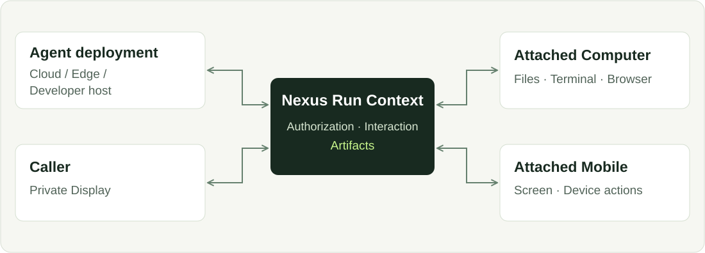
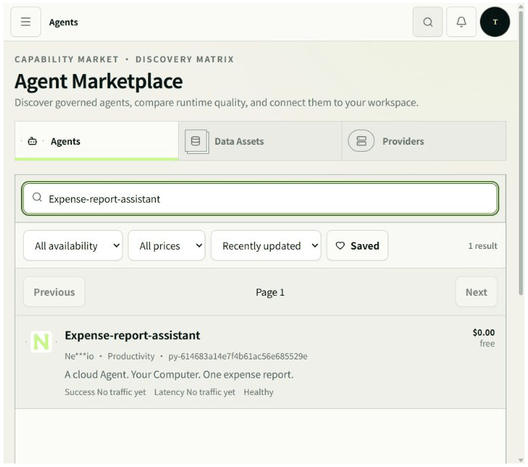
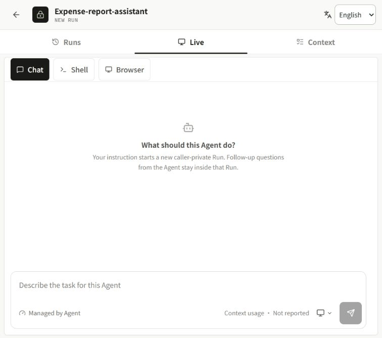
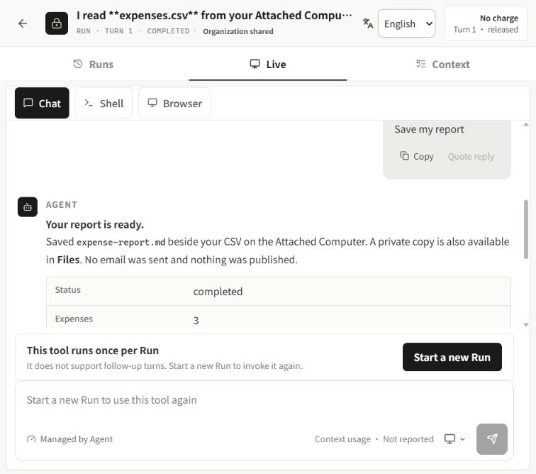

<div align="center">

# Nexus Cloud

**Your Agents. Your models. Your devices.**

[](LICENSE)
[](https://cloud.nexilume.com/)
[](nexus_server/nexus_personal/WORKFLOWS.md)
[](#citation)


**English** · [Chinese](README_zh.md)

[Motivation](#motivation) · [Watch the workflow](#see-it-in-action) · [Features](#features) · [Use cases](#use-cases) · [Quick start](#quick-start) · [Documentation](#documentation) · [Ecosystem downloads](#ecosystem) · [Contributing](#contributing) · [Citation](#citation)

</div>

> **[Try Nexus Cloud online](https://cloud.nexilume.com/)**: Explore Nexus Cloud in your browser, or self-host to get started.

An Execution Fabric for AI Agents Across Cloud, Edge, and Devices.


## Motivation

| Product | From the user's perspective |
| --- | --- |
| **Nexus** | **A developer builds and deploys the Agent. I choose my own device for it to work on.** |
| OpenClaw | I deploy and configure an assistant that works for me through channels and nodes. |
| Codex | I choose a working environment, give Codex a task, then review and refine the results. |


Your files may be on your computer, your next task in a browser, and another
workflow on your phone. You should not have to move that work to the developer's
machine—or install every Agent's application and dependencies on your own.

Nexus lets a separately hosted Agent work with the devices you attach and
authorize. For you, that means:

- **Less to install and maintain.** Use a cloud- or developer-hosted Agent without
  deploying that Agent on your computer. Pair the device Runtime once, then
  authorize the Agents you choose to use with it.
- **Work in your own environment.** Let an Agent handle files in your authorized
  workspace, use your Computer's terminal or isolated browser, or operate your
  attached phone. You choose the device and approve the requested access.
- **Choose the device that fits the task.** Use the same Agent with different
  supported devices for different tasks, without redeploying it for each device.
  The Agent and device do not need to share a machine or local network.
- **One place to follow the work.** Private Display gives you a consistent place
  to chat, see progress, answer questions, add instructions and inspect results,
  even when the work happens on an attached device.

For example, an Agent hosted in Docker can process a file in your authorized
Computer workspace and return the result to Private Display. You do not need to
deploy that Agent on the Computer first.

This is the idea behind a **decoupled Agent execution fabric**: **separate where
an Agent is deployed from the user-authorized devices it can operate, and connect
them through a shared execution context—the Run Context.**



For developers, the same separation reduces repeated work on device connectivity,
interaction UIs and execution state. Nexus provides Python Agent build and
deployment workflows, Run authorization and observability; Enterprise adds
commercial billing.

Devices still need a compatible Runtime, working connectivity and explicit
authorization. Pairing alone does not grant Agent access, and choosing another
device does not automatically migrate an in-progress terminal or browser session.

**The Agent can live elsewhere. The task can happen on the device you choose.**

## See it in action

**An Agent in Docker. A CSV on your Computer. A report you approve.**

You want a short report from `expenses.csv` on your Computer. The developer has
already deployed the Agent; you do not install its code or dependencies locally.
Your Computer only needs the paired Nexus Computer Runtime.

### 1. Pick the Agent, then choose your Computer

Find the assistant in **Marketplace**, open its details and select **Attach
Computer**. Approve its file permissions and choose your online device.



*The Agent is already hosted. You supply the authorized place to work—not another
Agent installation.*

### 2. Ask once. Stay in control.

Open **Private Display** and ask: “Turn my expenses.csv into a short report. Ask
before writing it.” The Agent reads the file through Run Context, updates its Plan
and asks for confirmation **inside the same conversation**.



*The sample contains three synthetic expenses totaling $128.50. Nothing is written
until the caller chooses **Save my report**.*

### 3. Get the result where you need it

The Agent writes `expense-report.md` beside the CSV **on the Attached Computer**.
A private copy opens in **Files** for preview and download. The original CSV is
unchanged; the Computer file, Run artifact and browser download have matching
SHA-256 hashes.



**One Agent deployment. Your chosen device. One place to follow the work.**

<details>
<summary>Run this example yourself · source, setup and capture notes</summary>

1. Configure a supported Python build worker, Docker execution and private file
   storage. Upload [readme_computer_agent.py](examples/readme_computer_agent.py)
   through **Build → Agents → Runtime → Upload Python**, then build and deploy.
2. Pair Nexus Computer Runtime with an isolated test Workspace. Attach it to the
   Agent and approve `files.list`, `files.read` and `files.write`—no terminal or
   browser permission is requested.
3. Place [expenses.csv](examples/expenses.csv) in this Agent's Workspace on the
   Computer (`<paired-root>/agents/<agent-id>/workspace/` in this capture), then
   open Private Display and send the request above.
4. Choose **Save my report**. Where output scanning is required, an authorized
   operator must scan and approve the private artifact before preview/download.

The example is deterministic and needs no model API key; it demonstrates device
execution, not model reasoning. File contents travel through the authorized Cloud
execution path—this is not a claim that data never leaves the Computer.

Recorded on the existing **Enterprise** installation with a real Docker Agent and
Windows Computer Runtime in an isolated demo workspace. Marketplace is an
Enterprise entry point; self-hosters can open the Agent from **Build → Agents**.
These GIFs are edited real-browser keyframes with shortened waits, not UI mockups,
a continuous video or a speed benchmark.

[Verified steps, boundaries and reproduction notes](docs/media/device-demo-notes.md)
· [Capture checksums](docs/media/device-demo-manifest.json)

</details>

<a id="highlights"></a>

## Features

- **Deploy agents independently of user devices.** Host agents in Docker, on a
  developer's computer, or through an OpenWrt-connected edge deployment. Each user
  chooses the authorized devices where the work happens.
- **Connected computers and Android phones.** Work with files, terminals, isolated
  browsers and supported Android actions through Attached Computer and Mobile.
  The Computer Runtime and Android app connect outbound to Cloud, without requiring
  inbound SSH access to the devices.
- **Python SDK and MCP integration.** Turn Python capabilities into callable agent
  services. Keep your preferred model and agent framework while using Nexus for
  serving, device access and user interaction.
- **A built-in interface for every agent.** Private Display brings chat, progress,
  plans, inline questions, browser views and file outputs into one place, reducing
  the need to build a separate interaction UI for each agent.
- **User-authorized execution.** Users explicitly attach devices and approve
  requested permissions. Run-scoped delegation connects each invocation to the
  appropriate caller, device and workspace.
- **Execution history and observability.** Track runs, inspect errors, review
  terminal output and retrieve generated artifacts. Supported workflows can
  continue across turns while retaining their execution context.
- **Model API routing.** Connect Providers and organize access through Execution
  and Aggregation Routers, giving applications a consistent API for configured
  models.
- **Files and reusable Data Assets.** Import files and images, preview supported
  formats and archive agent-generated outputs into Data Assets, with scanning
  and access controls where configured.
- **Agent distribution and monetization.** Publish agents through Marketplace and
  support fixed or agent-reported pricing in the commercial edition.

Marketplace, Organization access administration and billing are Enterprise
capabilities; see [Community or Enterprise?](#community-or-enterprise). Device
operations require compatible runtimes, working connectivity and explicit
authorization.

## Use cases

| Use case | How Nexus helps |
| --- | --- |
| **File assistants for other people** | Deploy a report-writing agent once. Users attach their own computers and authorize a workspace to analyze spreadsheets or generate documents, without installing the agent itself. |
| **Browser automation on the user's computer** | Navigate websites, fill forms and collect results in an isolated browser on the Attached Computer, with screenshots and progress visible in Private Display. |
| **Computer-to-phone workflows** | Combine computer files and processing with authorized Android interactions—for example, prepare information on a computer and use it in a mobile workflow. |
| **Developer and operations assistants** | Inspect an approved workspace, execute authorized commands, analyze logs and produce diagnostic reports while the user follows the work. |
| **Edge-hosted agent services** | Keep an agent on a developer machine or an OpenWrt-connected network and make it available through Nexus without moving its application into a Cloud container. |
| **Shared agent products** | In Enterprise, offer the same deployed agent to multiple users, with each caller supplying their own authorized devices, workspace and private interaction session. |
| **A unified model access layer** | Bring configured model Providers behind Router APIs so applications use consistent endpoints while routing policies remain centrally managed. |

**Nexus separates where an agent runs from where its users need work done.**

## Quick start

**Before you start:** Git, Docker with Linux containers, Compose v2 and at least 4 GiB available memory on the recommended x86_64 host. Repository access is required.

```sh
git clone https://github.com/Nexilume-AI/nexus-cloud.git
cd nexus-cloud
docker compose -f deploy/community/compose.yaml up -d --build --wait
```

Open **http://127.0.0.1:18090**. Sign in as **owner@example.local** using the generated password retrieved locally:

```sh
docker compose -f deploy/community/compose.yaml run --rm --no-deps --entrypoint cat initialize /var/lib/nexus-bootstrap/owner-password
```

Change that password in Settings. First startup builds images and initializes storage; subsequent starts reuse persisted data.

> [!IMPORTANT]
> This starts Cloud, not a ready-made Agent execution fleet. Configure execution controllers separately. Remote Computer/Mobile pairing requires working HTTPS/WSS. Follow the [Docker deployment guide](deploy/community/README.md) before exposing the installation. Upstream model usage may incur charges.

## Your first workflow

1. Connect a Provider and verify its models. Direct API needs only your existing
   endpoint. **Codex Proxy** / CLIProxyAPI require the explicit
   [Provider execution setup](deploy/community/PROVIDERS.md), available for
   native and Compose installs. Docker Engine is a host prerequisite, not a pip
   dependency; the default Cloud stack does not receive the Docker socket.
2. Create a Pool and Router for model access when your workflow needs one.
3. Configure execution, deploy an Agent and check runtime health.
4. Open Private Display, send a message and inspect the result.
5. Pair and attach a Computer or Mobile only if the Agent needs it.

**Success looks like:** a healthy deployed runtime, a completed Run and its returned result or outputs. A paired device must also be online and authorized; pairing alone does not grant access.

## Community or Enterprise?

Choose the edition for your deployment:

| | Community | Enterprise |
| --- | --- | --- |
| Intended use | Authenticated, single-owner self-hosting | Organization and commercial operations |
| Agents, Private Display, model routing, Data Assets and device integrations | Shared product capabilities; setup required | Shared product capabilities; setup required |
| Access administration | Not included | Organization / Project roles and machine identities |
| Billing and TokenBank | Not included | Commercial billing and accounting capabilities |
| Agent, model and data Marketplaces | Not included | Marketplace workflows |
| Source distribution | Source-available community source in this repository | Separately distributed proprietary implementation |


## Documentation

| Goal | Guide |
| --- | --- |
| Docker deployment, persistence and backups | [Docker guide](deploy/community/README.md) |
| Native Linux installation | [Linux guide](nexus_server/nexus_personal/LINUX.md) |
| Native Windows, execution and HTTPS/WSS | [Operator guide](nexus_server/nexus_personal/HOST.md) |
| Complete a model/Agent/device workflow | [Workflows](nexus_server/nexus_personal/WORKFLOWS.md) |
| Configure router-facing Relay | [Relay setup](README_GUIDE.md#included-relay-server) |
| Review compatibility before upgrading | [Release notes](RELEASE_NOTES.md) |
| Source layout, provenance and detailed setup | [Installation reference](README_GUIDE.md) |

The reference retains the previous setup and troubleshooting material. Historical comparisons and test statements there are dated evidence, not live status.

## Ecosystem

Install only the components you need. Cloud, the SDK and device runtimes are distributed separately.

| Component | Use it for | Download / setup |
| --- | --- | --- |
| **[Nexus Cloud](https://github.com/Nexilume-AI/nexus-cloud)** | Server, Web Console and bundled Cloud Relay | [Quick start](#quick-start) |
| **Python SDK** | Build Agent applications | [PyPI: nexilume](https://pypi.org/project/nexilume/) · [Wheel / source package](https://pypi.org/project/nexilume/#files) · [SDK guide](https://github.com/Nexilume-AI/nexus-agent-sdk-python#quick-start) |
| **Computer Runtime** | Connect your computer for authorized file, terminal and browser operations | Included in the SDK · [Setup guide](https://github.com/Nexilume-AI/nexus-agent-sdk-python#connect-your-computer) |
| **Android app** | Connect your phone for authorized Agent workflows | [Download APK · 0.1.2-beta.2](https://github.com/Nexilume-AI/nexus-mobile/releases/download/v0.1.2-beta.2/nexus-mobile-0.1.2-beta.2.apk) · [Release notes & checksums](https://github.com/Nexilume-AI/nexus-mobile/releases/tag/v0.1.2-beta.2) |
| **OpenWrt** | Edge registration and capability routing | [Download x86_64 packages · Beta](https://github.com/Nexilume-AI/nexus-openwrt/releases/tag/v0.1.0-beta.1) · [Installation guide](https://github.com/Nexilume-AI/nexus-openwrt/blob/main/docs/package-install.md) |
| **Documentation** | Tutorials and reference | [Read the docs](https://github.com/Nexilume-AI/nexus-docs) |

**Install the Python SDK:**

```sh
python -m pip install --upgrade nexilume
```

For MCP integrations, install `"nexilume[fastmcp]"` instead. The package name is `nexilume`; the Python import remains `nexus_agent`.

**Connect a Computer, including optional browser support:**

```sh
python -m pip install --upgrade "nexilume[computer,browser]"
nexus-computer setup "<pairing-url-from-your-cloud>"
```

Use a virtual environment; Python 3.12 is recommended for optional integrations. Browser control also requires a compatible local Chromium browser.

**Android:** requires Android 8.0+. Check the release notes and checksums before installing; [all Android releases](https://github.com/Nexilume-AI/nexus-mobile/releases) are available separately.

## Contributing

Small reproducible fixes, clearer tutorials, translations and sanitized examples are welcome. Before submitting a change, follow the setup and checks for the component you touch. Use [Issues](https://github.com/Nexilume-AI/nexus-cloud/issues) for reproducible bugs; include versions and redacted diagnostics, never credentials or private files.

Report sensitive security issues privately to the repository maintainers. Release checks and CI are not a guarantee of production readiness on every platform.

## Citation

If Nexus supports your research or engineering work, please cite the technical report below, rather than the software repository. [CITATION.cff](CITATION.cff) provides the same report metadata through `preferred-citation`.

Nexilume Research. *Nexus: An Execution Fabric for AI Agents Across Cloud, Edge, and Devices*. Technical Report NX-SYS-2026-001, September 2026.

```bibtex
@techreport{nexilume2026nexus,
  author      = {{Nexilume Research}},
  title       = {{Nexus}: An Execution Fabric for {AI} Agents Across Cloud, Edge, and Devices},
  institution = {Nexilume Research},
  type        = {Technical Report},
  number      = {NX-SYS-2026-001},
  year        = {2026},
  month       = sep
}
```

## License

Nexus-authored source is distributed under [Apache License 2.0 (modified)](LICENSE). Third-party components retain their own licenses and notices. Documentation does not grant rights to separately distributed Enterprise implementation.

### Licensing conditions

Nexus is licensed under a modified version of the Apache License 2.0, with the following additional conditions. Multi-tenant service operation and removal of existing Nexus UI branding require prior written authorization. Earlier Apache-2.0 grants and third-party licenses remain unchanged. Contributions require explicit agreement permitting commercial use and future relicensing. See [LICENSING.md](LICENSING.md). Authorization contact: **cary.nexilume@outlook.com**.
