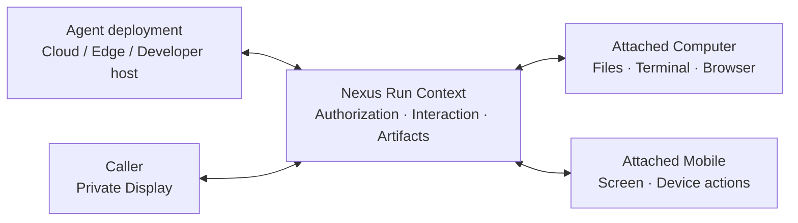

<div align="center">

# Nexus Cloud

**Your Agents. Your models. Your devices.**

[](LICENSE)
[](https://cloud.nexilume.com/)
[](nexus_server/nexus_personal/WORKFLOWS.md)
[](#citation)

`Self-hosted` · `Docker Compose` · `Single owner`

**English** · [Chinese](README_zh.md)

[Motivation](#motivation) · [Highlights](#highlights) · [Quick start](#quick-start) · [Documentation](#documentation) · [Ecosystem](#ecosystem) · [Contributing](#contributing) · [Citation](#citation)

</div>

> **[Try Nexus Cloud online](https://cloud.nexilume.com/)**: Explore Nexus Cloud in your browser, or self-host to get started.

A self-hosted, single-owner workspace for running Agents, routing model requests, managing Data Assets and connecting authorized devices.


## Motivation

| Product | From the user's perspective |
| --- | --- |
| **Nexus** | **A developer builds and deploys the Agent. I choose my own device for it to work on.** |
| OpenClaw | I deploy and configure an assistant that works for me through channels and nodes. |
| Codex | I choose a working environment, give Codex a task, then review and refine the results. |


Your files may be on your computer, your next task in a browser, and another
workflow on your phone. You should not have to move that work to the developer's
machine—or install every Agent's application and dependencies on your own.

Nexus lets a separately hosted Agent work with the devices you attach and
authorize. For you, that means:

- **Less to install and maintain.** Use a cloud- or developer-hosted Agent without
  deploying that Agent on your computer. Pair the device Runtime once, then
  authorize the Agents you choose to use with it.
- **Work in your own environment.** Let an Agent handle files in your authorized
  workspace, use your Computer's terminal or isolated browser, or operate your
  attached phone. You choose the device and approve the requested access.
- **Choose the device that fits the task.** Use the same Agent with different
  supported devices for different tasks, without redeploying it for each device.
  The Agent and device do not need to share a machine or local network.
- **One place to follow the work.** Private Display gives you a consistent place
  to chat, see progress, answer questions, add instructions and inspect results,
  even when the work happens on an attached device.

For example, an Agent hosted in Docker can process a file in your authorized
Computer workspace and return the result to Private Display. You do not need to
deploy that Agent on the Computer first.

This is the idea behind a **decoupled Agent execution fabric**: **separate where
an Agent is deployed from the user-authorized devices it can operate, and connect
them through a shared execution context—the Run Context.**



For developers, the same separation reduces repeated work on device connectivity,
interaction UIs and execution state. Nexus provides Python Agent build and
deployment workflows, Run authorization and observability; Enterprise adds
commercial billing.

Devices still need a compatible Runtime, working connectivity and explicit
authorization. Pairing alone does not grant Agent access, and choosing another
device does not automatically migrate an in-progress terminal or browser session.

**The Agent can live elsewhere. The task can happen on the device you choose.**

## See it in action

 An isolated demo account runs a
small Python Agent in a real Docker container. The example is deterministic: no
paid model, personal Computer or Mobile is used. Enterprise menus and commercial
features shown here.

### Ask, confirm, inspect


*An SDK `chat.ask()` question stays inline with the conversation. The caller
chooses the audience before the Agent continues.*

<details>
<summary>See the live plan, completed conversation and Markdown output</summary>


*Plan updates come from the running Agent, not a presentation mockup.*


*Files distinguishes outputs and provides a preview and download controls.*


*The scanned file was archived to the demo Project's collection. No public release
or Marketplace publication was created.*

</details>

**Try the same example:** upload [readme_launch_agent.py](examples/readme_launch_agent.py)
through **Agents → Runtime → Upload Python**, build, deploy, then choose **Test Agent
privately**. Ask for a launch checklist and answer the audience question. A supported
Python build profile, execution worker and private file storage must be configured.
This installation requires **Data Assets → Scan output** approval before file preview;
the linked capture guide includes that step.

[Capture details and reproduction steps](docs/media/capture-notes.md). These are
original screenshots, not a video or a claim that every integration was tested.

## Highlights

| Bring your own | What you can do | First guide |
| --- | --- | --- |
| **Models** | Connect Providers, organize Sources and Pools, expose routing endpoints | [Workflows](nexus_server/nexus_personal/WORKFLOWS.md) |
| **Agents** | Manage versions and deployments; interact through Private Display | [Execution setup](nexus_server/nexus_personal/HOST.md) |
| **Data** | Manage files and Data Assets for supported Agent workflows | [Workflows](nexus_server/nexus_personal/WORKFLOWS.md) |
| **Devices** | Attach separately installed Computer, Mobile or OpenWrt runtimes | [Operator guide](nexus_server/nexus_personal/HOST.md) |

## Quick start

**Before you start:** Git, Docker with Linux containers, Compose v2 and at least 4 GiB available memory on the recommended x86_64 host. Repository access is required.

```sh
git clone https://github.com/Nexilume-AI/nexus-cloud.git
cd nexus-cloud
docker compose -f deploy/community/compose.yaml up -d --build --wait
```

Open **http://127.0.0.1:18090**. Sign in as **owner@example.local** using the generated password retrieved locally:

```sh
docker compose -f deploy/community/compose.yaml run --rm --no-deps --entrypoint cat initialize /var/lib/nexus-bootstrap/owner-password
```

Change that password in Settings. First startup builds images and initializes storage; subsequent starts reuse persisted data.

> [!IMPORTANT]
> This starts Cloud, not a ready-made Agent execution fleet. Configure execution controllers separately. Remote Computer/Mobile pairing requires working HTTPS/WSS. Follow the [Docker deployment guide](deploy/community/README.md) before exposing the installation. Upstream model usage may incur charges.

## Your first workflow

1. Connect a Provider and verify its models. Direct API needs only your existing
   endpoint. **Codex Proxy** / CLIProxyAPI require the explicit
   [Provider execution setup](deploy/community/PROVIDERS.md), available for
   native and Compose installs. Docker Engine is a host prerequisite, not a pip
   dependency; the default Cloud stack does not receive the Docker socket.
2. Create a Pool and Router for model access when your workflow needs one.
3. Configure execution, deploy an Agent and check runtime health.
4. Open Private Display, send a message and inspect the result.
5. Pair and attach a Computer or Mobile only if the Agent needs it.

**Success looks like:** a healthy deployed runtime, a completed Run and its returned result or outputs. A paired device must also be online and authorized; pairing alone does not grant access.

## Community or Enterprise?

Choose the edition for your deployment:

| | Community | Enterprise |
| --- | --- | --- |
| Intended use | Authenticated, single-owner self-hosting | Organization and commercial operations |
| Agents, Private Display, model routing, Data Assets and device integrations | Shared product capabilities; setup required | Shared product capabilities; setup required |
| Access administration | Not included | Organization / Project roles and machine identities |
| Billing and TokenBank | Not included | Commercial billing and accounting capabilities |
| Agent, model and data Marketplaces | Not included | Marketplace workflows |
| Source distribution | Source-available community source in this repository | Separately distributed proprietary implementation |

Enterprise can be featured here alongside Community. Screenshots and recordings must identify the edition used; an Enterprise demonstration is not proof that its menus or commercial features ship in Community. Publishing Enterprise product media does not publish its source code.

[Compare editions in detail](README_GUIDE.md#community-or-enterprise). Do not point Community and Enterprise at the same database.

## Documentation

| Goal | Guide |
| --- | --- |
| Docker deployment, persistence and backups | [Docker guide](deploy/community/README.md) |
| Native Linux installation | [Linux guide](nexus_server/nexus_personal/LINUX.md) |
| Native Windows, execution and HTTPS/WSS | [Operator guide](nexus_server/nexus_personal/HOST.md) |
| Complete a model/Agent/device workflow | [Workflows](nexus_server/nexus_personal/WORKFLOWS.md) |
| Configure router-facing Relay | [Relay setup](README_GUIDE.md#included-relay-server) |
| Review compatibility before upgrading | [Release notes](RELEASE_NOTES.md) |
| Source layout, provenance and detailed setup | [Installation reference](README_GUIDE.md) |

The reference retains the previous setup and troubleshooting material. Historical comparisons and test statements there are dated evidence, not live status.

## Ecosystem

| Project | Role | Install separately? |
| --- | --- | --- |
| [Nexus Cloud](https://github.com/Nexilume-AI/nexus-cloud) | Server, Web Console and bundled Cloud Relay | Main workspace |
| [Python SDK](https://github.com/Nexilume-AI/nexus-agent-sdk-python) | Agent applications and outbound Computer Runtime | Yes |
| [OpenWrt](https://github.com/Nexilume-AI/nexus-openwrt) | Edge registration and capability routing | Optional |
| [Mobile](https://github.com/Nexilume-AI/nexus-mobile) | Authorized Android device integration | Optional |
| [Documentation](https://github.com/Nexilume-AI/nexus-docs) | User guides and reference | Read online or build locally |

Repository access, release availability and compatibility determine which integrations you can install. Cloud installation does not install device runtimes.

## Contributing

Small reproducible fixes, clearer tutorials, translations and sanitized examples are welcome. Before submitting a change, follow the setup and checks for the component you touch. Use [Issues](https://github.com/Nexilume-AI/nexus-cloud/issues) for reproducible bugs; include versions and redacted diagnostics, never credentials or private files.

Report sensitive security issues privately to the repository maintainers. Release checks and CI are not a guarantee of production readiness on every platform.

## Citation

If Nexus supports your research or engineering work, please cite the technical report below, rather than the software repository. [CITATION.cff](CITATION.cff) provides the same report metadata through `preferred-citation`.

Nexilume Research. *Nexus: An Execution Fabric for AI Agents Across Cloud, Edge, and Devices*. Technical Report NX-SYS-2026-001, September 2026.

```bibtex
@techreport{nexilume2026nexus,
  author      = {{Nexilume Research}},
  title       = {{Nexus}: An Execution Fabric for {AI} Agents Across Cloud, Edge, and Devices},
  institution = {Nexilume Research},
  type        = {Technical Report},
  number      = {NX-SYS-2026-001},
  year        = {2026},
  month       = sep
}
```

## License

Nexus-authored source is distributed under [Apache License 2.0 (modified)](LICENSE). Third-party components retain their own licenses and notices. Documentation does not grant rights to separately distributed Enterprise implementation.

### Licensing conditions

Nexus is licensed under a modified version of the Apache License 2.0, with the following additional conditions. Multi-tenant service operation and removal of existing Nexus UI branding require prior written authorization. Earlier Apache-2.0 grants and third-party licenses remain unchanged. Contributions require explicit agreement permitting commercial use and future relicensing. See [LICENSING.md](LICENSING.md). Authorization contact: **cary.nexilume@outlook.com**.
