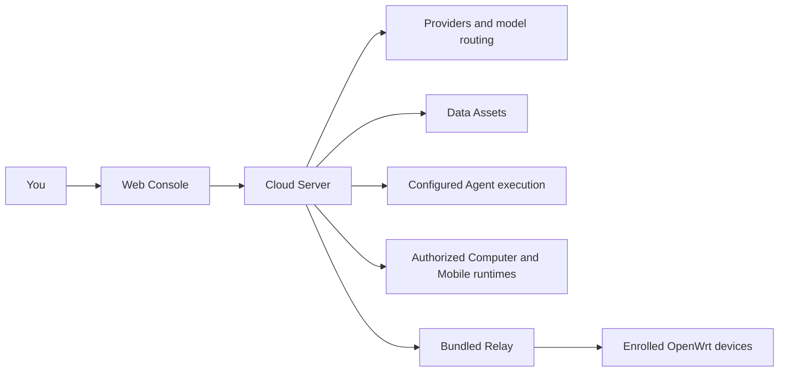

<p align="center">
  
</p>

# Nexus Cloud

**Run your own Agents. Connect your models, data and devices.**

Nexus Cloud is a self-hosted, single-owner workspace for deploying
Agents, routing model requests and connecting authorized Computer, Mobile and
OpenWrt runtimes. This repository includes the Cloud Server, Web Console and Relay.

[Quick start](#quick-start) · [Features](#what-you-can-do) ·
[Compare editions](#community-or-enterprise) ·
[Documentation](#documentation) · [Contributing](#contributing) · [Apache License 2.0 (modified)](LICENSE)

## What you can do

- **Bring your own models.** Connect Providers, organize models into Pools and expose scoped routing endpoints.
- **Operate your Agents.** Manage versions, deployments and Runs, then interact through Private Display.
- **Work with your data.** Manage Data Assets and make authorized files available to Agent workflows.
- **Connect your devices.** Pair separately installed Computer, Mobile and OpenWrt runtimes with explicit authorization.
- **Host the workspace yourself.** Run the Server, Console and bundled Relay with Docker Compose or a native installation.

## Quick start

Requires Git, Docker Engine or Docker Desktop using Linux containers, and
Compose v2. The Docker guide recommends x86_64 with at least 4 GiB of available
memory. Access to this repository is required while it is private.

### One-command Docker deployment

Clone the source, then start the stack:

```sh
git clone https://github.com/Nexilume-AI/nexus-cloud-community.git
cd nexus-cloud-community
docker compose -f deploy/community/compose.yaml up -d --build --wait
```

Open **http://127.0.0.1:18090** and sign in as **owner@example.local**.
Retrieve the generated initial password locally:

```sh
docker compose -f deploy/community/compose.yaml run --rm --no-deps --entrypoint cat initialize /var/lib/nexus-bootstrap/owner-password
```

Change the password in Settings after signing in. The first launch builds the
images and initializes the installation; subsequent starts reuse its data.

This starts the Cloud services. Agent/Provider execution controllers and device
runtimes require separate setup. Follow the [Docker guide](deploy/community/README.md)
for HTTPS/WSS, persistence, backups and execution configuration before connecting
remote devices. Model providers may charge for usage.

## Your first workflow

1. **Connect a Provider** and check its available models. Direct API uses your
   existing endpoint. Codex Proxy / CLIProxyAPI require the optional
   [Provider execution setup](deploy/community/PROVIDERS.md); Docker Engine is
   a host prerequisite, not installed by pip or the default Cloud stack.
2. **Create a Model Pool and Router** for the models you want to use.
3. **Configure execution** using the [operator guide](nexus_server/nexus_personal/HOST.md), then deploy your Agent and verify its runtime health.
4. **Open Private Display** to interact with the Agent. Attach files or pair a device when the Agent supports those capabilities.

The [workflow guide](nexus_server/nexus_personal/WORKFLOWS.md) explains each stage,
including credentials, deployment requirements and device consent.



Connections in this overview require their respective installation and
configuration steps; the diagram does not imply automatic provisioning.

## Community or Enterprise?

Community is designed for one owner operating their own workspace. Enterprise
adds organization administration and commercial services. The table describes
implementation boundaries, not a support SLA or a guarantee that every service
is enabled in a particular Enterprise deployment.

| Area | Nexus Cloud | Nexus Cloud Enterprise |
| --- | --- | --- |
| Intended use | Your own self-hosted Agent workspace | Organization and commercial platform operation |
| Identity and access | Single owner; authenticated requests, scoped credentials and device consent | Organization/tenant membership and role administration, with enterprise access policies |
| Providers and model routing | Bring your own Providers; Sources, Model Pools and Routers | Routing plus commercial provider and gateway accounting integrations |
| Agents | Owner-local catalog, versions, deployments, Runs and Private Display | Shared execution capabilities plus enterprise access and commercial Agent policies |
| Data Assets | Owner-local file and asset lifecycle | Enterprise ownership/access policies and commercial asset workflows |
| Computer and Mobile | Cloud integration endpoints; separately installed runtimes and explicit device authorization | Device integrations with enterprise access policies |
| OpenWrt and Relay | Bundled Relay server; separate OpenWrt firmware, enrollment and network setup | Edge integration with enterprise policies and deployment services |
| Usage and billing | Operational usage/cost observations; no Nexus wallet settlement | Commercial billing, wallet/plan and TokenBank services |
| Marketplaces | No commercial Marketplace publication or acquisition | Commercial Marketplace workflows, subject to deployment configuration |
| Installation | Docker Compose or native Linux/Windows installation operated by you | Access an organization-provided service; end users do not need a local Cloud Server |
| Source distribution | Nexus-authored source under Apache License 2.0 (modified); upstream components retain their own terms | Private enterprise implementation is outside this repository and license grant |

Choose Community for your own Agents and infrastructure. Choose Enterprise
when you need organization administration or commercial platform workflows.
Community still enforces authorization; a single-owner installation is not an
anonymous gateway. The editions use separate configuration and databases, so
do not switch editions by pointing one at the other's database.

## How does it compare with other projects?

These projects overlap but focus on different parts of an AI system. The table
compares documented use cases, not performance or overall quality. Plugins and
custom code can extend each project; an integration is not the same as a
bundled, configured device runtime. Third-party documentation was checked on
2026-09-13; features and licensing can vary by version and edition.

| Project | Main focus and approach | When to evaluate it |
| --- | --- | --- |
| **Nexus Cloud** | An owner-local workspace combining Agent execution, model routing, Data Assets and authorized device integration | You want to operate your own Agents alongside Computer, Mobile or OpenWrt runtimes |
| **[Dify](https://www.dify.ai/)** | Visual AI applications, agentic workflows and knowledge retrieval pipelines | Your main task is building visual AI applications and RAG workflows |
| **[Flowise](https://docs.flowiseai.com/)** (archived) | Visual Agent and LLM orchestration through Assistant, Chatflow and Agentflow | You are evaluating existing Flowise flows; check upstream maintenance status first |
| **[LiteLLM](https://docs.litellm.ai/docs/)** | A unified model SDK and Proxy with retries/fallbacks, virtual keys and cost tracking | You need model access and gateway operations for an existing application |

Dify's scope is documented on its [official product page](https://www.dify.ai/)
and [knowledge pipeline page](https://www.dify.ai/rag). Flowise's builders and
integrations are described in its [official introduction](https://docs.flowiseai.com/).
LiteLLM's SDK and Proxy are described in its [official quick start](https://docs.litellm.ai/docs/).
These are self-hostable ecosystem alternatives; do not assume identical
open-source license terms. For example, Dify publishes its own
[license terms](https://github.com/langgenius/dify/blob/main/LICENSE).

Flowise is marked archived in its [upstream repository](https://github.com/FlowiseAI/Flowise). Review its maintenance status before choosing it for a new deployment.

For Nexus device integration, install the compatible
[Python SDK / Computer Runtime](https://github.com/Nexilume-AI/nexus-agent-sdk-python),
[OpenWrt](https://github.com/Nexilume-AI/nexus-openwrt) or
[Mobile](https://github.com/Nexilume-AI/nexus-mobile) project separately.
Availability depends on repository access and published releases. Starting the
Cloud stack alone does not install these clients or configure public networking.

## Documentation

| I want to... | Start here |
| --- | --- |
| Deploy with Docker and manage persistent data | [Docker deployment](deploy/community/README.md) |
| Develop or install natively on Linux | [Linux guide](nexus_server/nexus_personal/LINUX.md) |
| Configure Windows/native services, HTTPS and execution | [Operator guide](nexus_server/nexus_personal/HOST.md) |
| Connect models, deploy Agents and use devices | [Community workflows](nexus_server/nexus_personal/WORKFLOWS.md) |
| Configure router-facing Relay networking | [Included Relay server](#included-relay-server) |
| Check deployment limitations before upgrading | [Release notes](RELEASE_NOTES.md) |

## Development

Native development uses Python 3.14 and Node.js 24. Start with a dedicated
installation and dependency environment. Linux and Windows instructions are
provided below; Docker users can stay with the quick start above.

<details>
<summary>Native build and launcher commands</summary>

### Native development and installation

For Linux, follow the complete [native development guide](nexus_server/nexus_personal/LINUX.md)
for venv setup, Server/Web builds, PostgreSQL/Redis, owner initialization and
`bash ./start-nexus-community.sh start --installation <absolute-directory>`.
The Linux launcher also supports `stop`, `restart`, `status` and `check`.

Use a new Python 3.14 environment and Node.js 24. Do not reuse an existing
commercial installation, database, credentials or dependency environment.

From `nexus_server/`, install the build and runtime dependency locks described
in the [operator guide](nexus_server/nexus_personal/HOST.md), using the matching
`win-py314` or `linux-py314` files. Then build the Server without resolving
additional dependencies:

```text
python -m pip wheel --no-deps --no-build-isolation . --wheel-dir dist
```

On Windows, after preparing and initializing the dedicated installation described below,
start all configured Community processes from the source root:

```powershell
.\start-nexus-community.ps1 -InstallationDirectory C:\Nexus\Community
```

Use `-Restart`, `-StopOnly` and `-CheckOnly` for lifecycle and diagnostics. The
launcher serves the verified Web bundle through the Community backend, so it
does not start Vite. Its HTTP listener is loopback-only and must remain behind
the installation's HTTPS/WSS reverse proxy. It does not use Enterprise Cloud,
an OpenWrt checkout, Docker provisioning or a shared database. Relay starts from its bundled runtime.

For a disposable test installation whose configured origin is the same
`https://127.0.0.1:<port>`, add `-LocalHttp`. It exposes only
`http://127.0.0.1:<port>` and never listens on another interface. This avoids a
local certificate prompt, but is not a production deployment mode.

From `nexus_web/`:

```text
npm ci --ignore-scripts
npm run build:community
```

The Console output is `nexus_web/dist/community/`. Keep its
`community-assets.json`, PDF assets and `THIRD_PARTY_NOTICES.txt` together.
Do not use the mixed-development Console entrypoint.

</details>

## Run your own installation

Follow the [operator guide](nexus_server/nexus_personal/HOST.md) for dedicated
PostgreSQL/Redis, HTTPS/WSS, private host configuration, owner initialization,
workers and controllers. Preparing configuration is not proof that these
services are running. Device pairing does not disable scope or caller checks.

Start with [Community workflows](nexus_server/nexus_personal/WORKFLOWS.md).
For client installation, use the guide provided with the separate SDK release.
See [release notes](RELEASE_NOTES.md) before enabling container or Edge workloads.

## Included Relay server

Relay starts with the Community processes and Compose stack. First startup creates
installation-specific device CA, Edge signing key, Relay TLS/client certificates,
ticket and JWT keys; restarts reuse them. The runtime is bundled in the Server
wheel and does not need an OpenWrt checkout. Node.js must be on PATH for native
launchers; the Docker image includes it.

The default tunnel listener is local-only on port 27444. For a new installation
that should accept routers, supply the server IP reachable by those routers:

```powershell
.\start-nexus-community.ps1 -InstallationDirectory C:\Nexus\Community -RelayAddress 192.168.1.10
```

```sh
bash ./start-nexus-community.sh start --installation /srv/nexus-community --relay-address 192.168.1.10
```

For Docker set `NEXUS_RELAY_ADDRESS=192.168.1.10` and
`NEXUS_RELAY_BIND=192.168.1.10` before running the usual Compose command. The Cloud
invoke port 27445 remains internal and requires mTLS plus a signed JWT.
Do not change an enrolled installation's advertised IP or delete its keys to
bypass a mismatch. Back up the installation and follow a planned migration.

Relay startup does not configure public DNS, firewall/NAT forwarding, IPv6, or
the Cloud HTTPS endpoint's verified-device-mTLS proxy. Router pairing still
requires the existing owner authorization and Edge ingress setup in
[nexus_server/nexus_personal/HOST.md](nexus_server/nexus_personal/HOST.md).

## Source layout

- `nexus_server/`: Community host and shared execution services.
- `nexus_web/`: Community Console.

OpenWrt firmware (including edge routing and LuCI), Mobile, and the Python Agent
SDK / Computer Runtime are independently released projects. Their source,
installers and firmware are not bundled here. Cloud-side integration endpoints
remain available; install compatible client/device releases separately when
using those integrations. The Server and Web source builds do not require
checking out those projects.

Commercial billing, TokenBank, Access administration and the three commercial
Marketplaces are not part of this source distribution. Community remains
authenticated: one owner does not mean anonymous access to devices or files.

## Contributing

Changes to shared code should preserve the public SDK interfaces, independent
Community composition, and host-selected extension contracts. Never introduce
a dependency on an unavailable private implementation. Use synthetic test data;
do not include tokens, device keys, personal files or deployment configuration.

Contributions require explicit acceptance of CONTRIBUTOR_LICENSE_AGREEMENT.md before merge.
Report suspected security issues privately to the repository maintainers before
posting exploit details or credentials in a public issue.

## License

Nexus-authored source is licensed under [Apache License 2.0 (modified)](LICENSE). Separately licensed
upstream components retain their own licenses and notices. Enterprise source is
outside this distribution.

## Source integrity

`community-source-manifest.json` records each exported file and its SHA-256.
It detects changed bytes; it is not a publisher signature. Obtain the archive
and its checksum from a trusted release channel. This export contains no Git
history, local deployment state, environment files or private commercial tree.

### Licensing conditions

Nexus is licensed under a modified version of the Apache License 2.0, with the following additional conditions. Multi-tenant service operation and removal of existing Nexus UI branding require prior written authorization. Earlier Apache-2.0 grants and third-party licenses remain unchanged. Contributions require explicit agreement permitting commercial use and future relicensing. See [LICENSING.md](LICENSING.md). Authorization contact: **cary.nexilume@outlook.com**.
