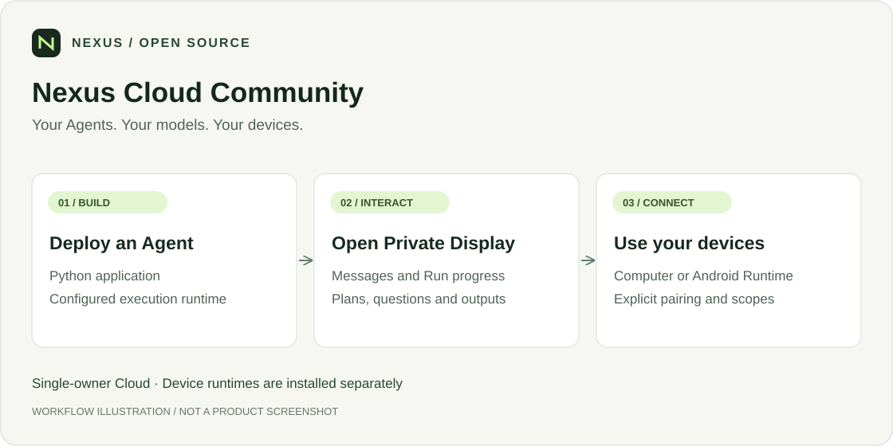
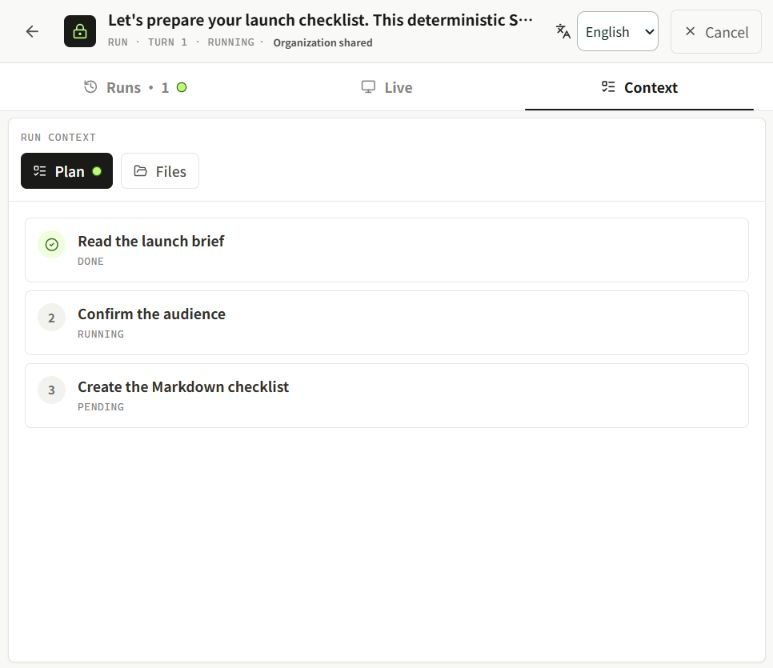
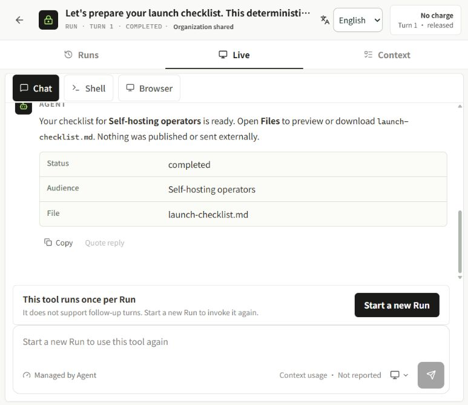
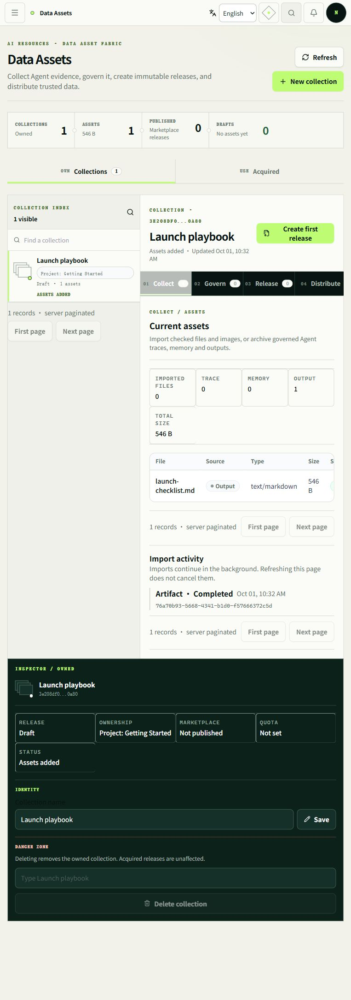

<div align="center">

# Nexus Cloud Community

**Your Agents. Your models. Your devices.**

[](LICENSE)
[](nexus_server/nexus_personal/WORKFLOWS.md)
[](#引用)

`Self-hosted` · `Docker Compose` · `Single owner`

[English](README.md) · **简体中文**

[功能](#可以做什么) · [快速开始](#快速开始) · [项目生态](#项目生态) · [参与贡献](#参与贡献) · [引用](#引用)

</div>

自托管、单用户的 Agent 工作区：运行 Agent、路由模型请求、管理数据文件，并连接已授权的设备。



*这是流程示意图，不是产品截图。实际连接需要完成下文的安装、配置与授权。*

## 真实运行画面

**Enterprise 企业版 · 2026 年 10 月 1 日采集。** 使用隔离演示账号，在真实 Docker
容器中运行 Python Agent。示例采用确定性逻辑，不调用付费模型，也不访问个人 Computer
或 Mobile。画面中的企业版菜单及商业功能不代表已包含在社区版。

### 发起任务、内联确认、查看产物


*SDK 的 `chat.ask()` 问题直接出现在对话中；用户选择目标读者后，Agent 才继续执行。*

<details>
<summary>展开查看实时 Plan、完成对话和 Markdown 文件预览</summary>



*Plan 状态由运行中的 Agent 上报，不是设计稿。*




*Files 区分文件产物，提供预览与下载入口。*



*该文件已归档到演示 Project 的集合，未创建公开发行版或上架 Marketplace。*

</details>

**复现此例：** 在 **Agents → Runtime → Upload Python** 上传
[readme_launch_agent.py](examples/readme_launch_agent.py)，构建并部署后点击 **Test Agent
privately**。发送生成发布清单的请求，并回答目标读者问题。需要先配置受支持的 Python
构建环境、执行 Worker 和私有文件存储。本次安装须先通过 **Data Assets → Scan output**
扫描才能预览文件，详细步骤见采集记录。

[采集记录与复现步骤](docs/media/capture-notes.md)。以上为原始截图，不是视频，也不代表已验证全部集成能力。

## 可以做什么

- **模型接入与路由**：连接 Provider，组织 Source 与 Pool，提供路由 API。
- **Agent 运行与交互**：管理版本、部署与 Run，通过 Private Display 对话和查看产物。
- **文件与数据**：管理 Data Assets，为支持的任务提供授权文件。
- **设备协作**：按需安装并配对 Computer、Android Mobile 或 OpenWrt。

## 快速开始

需要 Git、使用 Linux 容器的 Docker、Compose v2；推荐 x86_64 主机且至少有 4 GiB 可用内存，并具备仓库访问权限。

```sh
git clone https://github.com/Nexilume-AI/nexus-cloud-community.git
cd nexus-cloud-community
docker compose -f deploy/community/compose.yaml up -d --build --wait
```

打开 **http://127.0.0.1:18090**，账号为 **owner@example.local**。在本机读取初始随机密码：

```sh
docker compose -f deploy/community/compose.yaml run --rm --no-deps --entrypoint cat initialize /var/lib/nexus-bootstrap/owner-password
```

登录后修改密码。该命令启动 Cloud，不会自动安装设备 Runtime，也不会自动完成 Agent/Provider 执行控制器配置。远程设备需要可用的 HTTPS/WSS；模型供应商可能另外收费。

## 第一个完整流程

1. 连接 Provider 并确认模型可用。Direct API 使用已有接口；**Codex Proxy** / CLIProxyAPI 需额外配置 [Provider 执行环境](deploy/community/PROVIDERS.md)，支持原生安装命令与可选 Compose。Docker Engine 是宿主机前提，不由 pip 自动安装；默认 Cloud 不挂载 Docker socket。
2. 按需创建 Model Pool 与 Router。
3. 配置执行环境，部署 Agent 并检查健康状态。
4. 在 Private Display 发起任务，查看回复与文件产物。
5. 仅在任务需要时配对、Attach 并授权设备。

## 文档与边界

| 目标 | 入口 |
| --- | --- |
| Docker、持久化与备份 | [部署指南](deploy/community/README.md) |
| Linux 原生安装 | [Linux 指南](nexus_server/nexus_personal/LINUX.md) |
| Windows、执行环境、HTTPS/WSS | [运维指南](nexus_server/nexus_personal/HOST.md) |
| 模型、Agent、设备流程 | [工作流](nexus_server/nexus_personal/WORKFLOWS.md) |
| Relay 与详细安装参考 | [完整指南](README_GUIDE.md) |
| 升级注意事项 | [Release notes](RELEASE_NOTES.md) |

## 社区版与企业版

| | Community 社区版 | Enterprise 企业版 |
| --- | --- | --- |
| 适用场景 | 需要认证的单用户自托管 | 组织协作与商业运营 |
| Agent、Private Display、模型路由、Data Assets 与设备集成 | 共有产品能力，需要完成配置 | 共有产品能力，需要完成配置 |
| Access 管理 | 不包含 | Organization / Project 角色与机器身份 |
| Billing 与 TokenBank | 不包含 | 商业计费与账务能力 |
| Agent、模型与数据 Marketplace | 不包含 | Marketplace 工作流 |
| 源码发布 | 本仓库 源码可用的社区源码 | 独立分发的闭源实现 |

README 可以同时展示两个版本。截图和视频必须标注实际录制版本；企业版演示不代表其中的菜单或商业功能已包含在社区版。公开企业版产品素材不等于开放企业版源码。

社区版与企业版不能共用数据库；独立设备项目需分别安装。

## 项目生态

| 项目 | 职责 |
| --- | --- |
| [Cloud Community](https://github.com/Nexilume-AI/nexus-cloud-community) | Server、Web Console 与配套 Cloud Relay |
| [Python SDK](https://github.com/Nexilume-AI/nexus-agent-sdk-python) | Agent 应用与主动出站的 Computer Runtime |
| [OpenWrt](https://github.com/Nexilume-AI/nexus-openwrt) | 边缘注册、发现与能力路由 |
| [Mobile](https://github.com/Nexilume-AI/nexus-mobile) | 已授权的 Android 设备接入 |
| [Documentation](https://github.com/Nexilume-AI/nexus-docs) | 中英文教程与参考 |

设备组件独立安装与发布；是否可安装取决于仓库访问、发行包及版本兼容性。Cloud 启动不会自动安装它们。

## 参与贡献

欢迎可复现的问题修复、教程、翻译与脱敏示例；提交前请执行所改组件的检查。

问题反馈请附组件版本与脱敏复现步骤，不要上传凭据、个人文件或真实设备配置。安全问题请私下联系仓库维护者。 CI 通过不等于所有平台均已完成生产验收。

## 引用

在研究或工程工作中使用 Nexus 时，可以引用对应仓库，并注明实际使用的 release 或 commit。[CITATION.cff](CITATION.cff) 提供机器可读元数据；这是软件引用，不代表已有论文或 DOI。

```bibtex
@misc{nexus_cloud_community,
  author       = {{Nexus contributors}},
  title        = {Nexus Cloud Community},
  howpublished = {\url{https://github.com/Nexilume-AI/nexus-cloud-community}},
  note         = {Software; specify the release or commit used}
}
```

## 许可证

Nexus 自有代码采用 [Nexus Community License 1.0](LICENSE)。第三方组件保留各自许可证与声明；公开文档不授予独立企业版实现的使用权。

### Licensing conditions / 许可条件

Source-available, not unmodified Apache-2.0 or OSI-approved open source. Multi-tenant service operation and removal of existing Nexus UI branding require prior written authorization. Earlier Apache-2.0 grants and third-party licenses remain unchanged. Contributions require explicit agreement permitting commercial use and future relicensing. 许可说明：[LICENSING.md](LICENSING.md)。授权联系：**cary.nexilume@outlook.com**。
